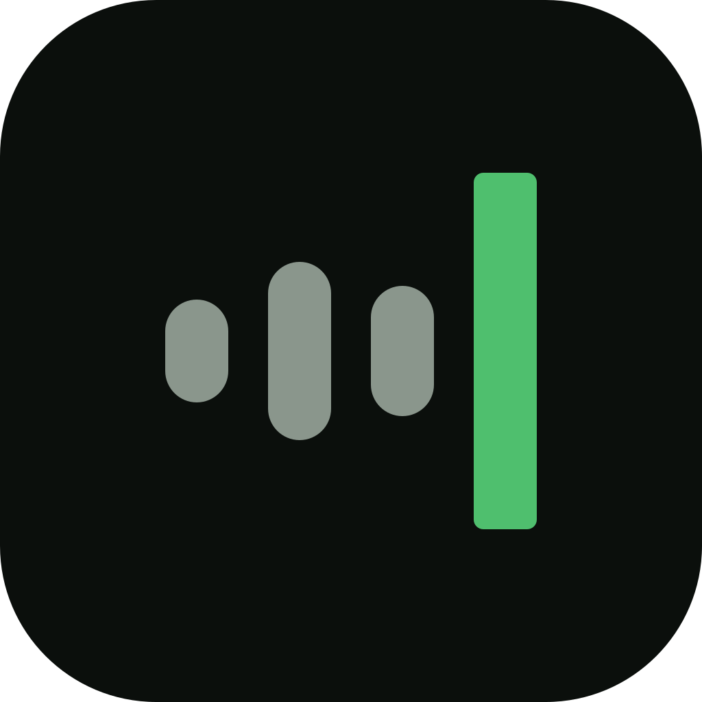

<p align="center">
  
</p>

<h1 align="center">Murmur</h1>

<p align="center">
  Local-first voice dictation. Hold a key, speak, and cleaned-up text lands at your cursor.
</p>

---

## What it is

Murmur is a dictation app for macOS and Windows. Press and hold a hotkey, talk, release —
your words are transcribed, tidied up, and pasted wherever your cursor already is.

Everything can run **on your own machine**. Transcription uses local Whisper or NVIDIA
Parakeet models, and the cleanup pass (removing "um", adding punctuation, fixing
capitalisation) runs on a local model through llama.cpp. There is no account, no
subscription, and no server to sign in to.

If you would rather use a cloud model, bring your own API key — OpenAI, Anthropic, Gemini,
Groq, OpenRouter, or your own self-hosted endpoint. Those are the only two paths: **your
key, or your machine.**

## Status

Early. The app builds and runs; it is being prepared for distribution to a small community.
Expect rough edges.

## Credit

Murmur is a fork of **[OpenWhispr](https://github.com/OpenWhispr/openwhispr)** by the
OpenWhispr Team, used under the MIT License. OpenWhispr is a much larger product — it also
does meeting transcription, calendar integration, semantic search over notes, team
workspaces, and a hosted subscription tier. Murmur removes all of that and keeps the
dictation core.

If you want those features, use OpenWhispr — it is actively maintained and very good.
Murmur exists only because a single-purpose, account-free dictation tool was wanted.

The upstream copyright notice is retained in [LICENSE](LICENSE), as the MIT License requires.

Some binaries are still fetched from upstream's release infrastructure
(`OpenWhispr/whisper.cpp` for GPU-accelerated whisper builds, and `OpenWhispr/openwhispr`
for the Windows key-listener and paste helpers).

## Building

Requires Node 24 (see `.nvmrc`).

```bash
npm install
npm run dev      # run in development
npm run pack     # build an unpacked app into dist/
```

macOS builds are ad-hoc signed. After packaging, the bundle needs:

```bash
xattr -cr dist/mac-arm64/Murmur.app
codesign --force --deep --sign - dist/mac-arm64/Murmur.app
```

Without that, an arm64 bundle will not launch — `electron-builder`'s `identity: null`
skips signing entirely rather than signing ad-hoc.

## License

MIT — see [LICENSE](LICENSE).
